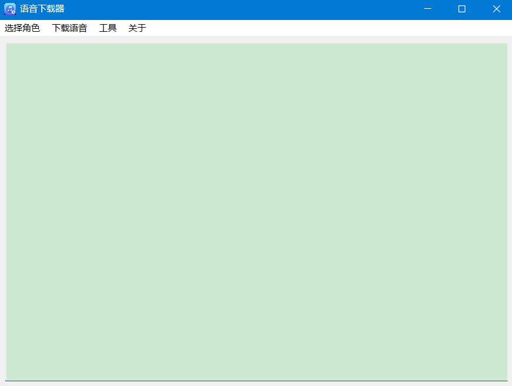
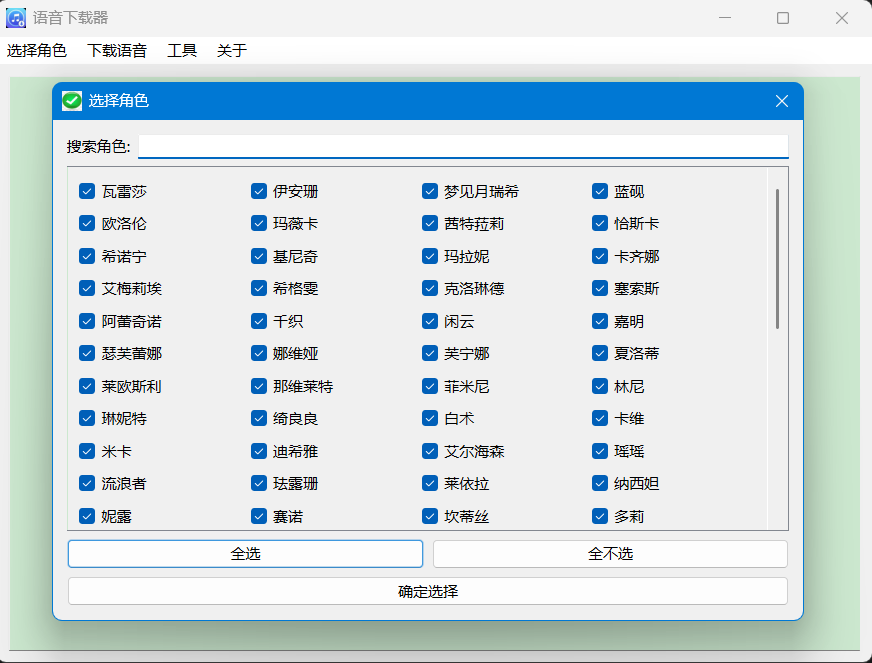
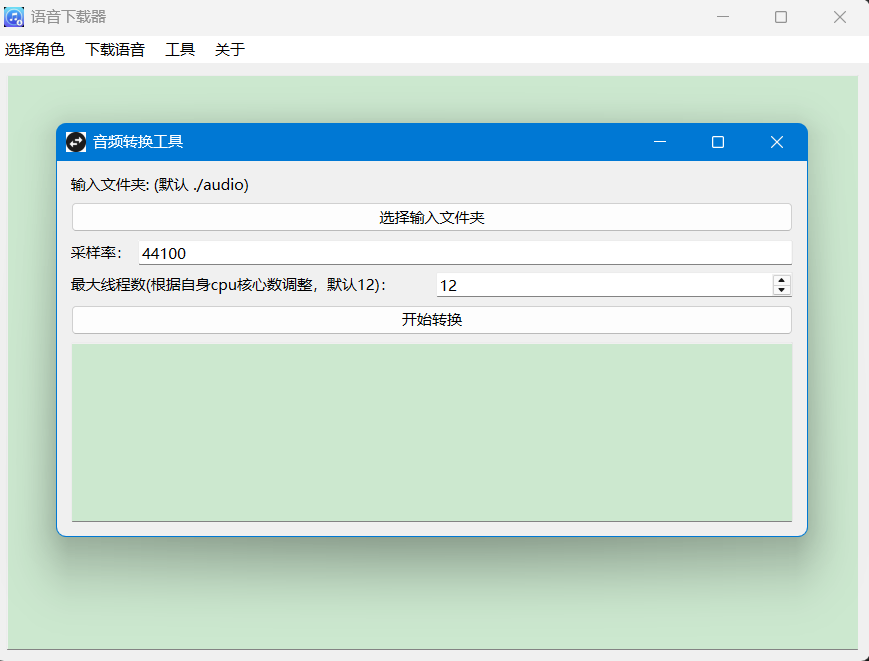

# 目录

**[English](README_en.md) | [简体中文](README.md)**

- [目录](#目录)
  - [下载地址](#下载地址)
  - [功能](#功能)
  - [程序结构](#程序结构)
  - [介绍](#介绍)
  - [安装和运行方式](#安装和运行方式)
    - [安装python库](#安装python库)
    - [运行程序](#运行程序)
      - [方法一](#方法一)
      - [方法二](#方法二)
  - [免责声明🛡️](#免责声明️)

## 下载地址

[点击此处进行下载](https://github.com/WorldDawnAres/mhy_music/releases)
>
> releases中.exe使用Python3.10.11版本打包，可能不支持Windows7以下系统使用
>
> Linux二进制文件则使用Python3.9.13版本打包。
>
> 喜欢这个项目吗？请给我留个星 ⭐，让更多人看到它！感谢你的支持！

## 功能

- [x] 支持自定义选择原神角色
- [x] 可选择中文，英文，日文，韩文
- [x] 支持Windows和Linux
- [x] 日志显示功能
- [ ] 文本文件合并
- [x] 自定义采样率转换wav文件
- [x] 支持自定义选择崩铁角色
- [ ] 支持深色模式

## 程序结构

```bash
mhy_music
├── /mhy_music
│   ├── /icon
│   │   └── icon.ico
│   ├── /txt
│   │   ├── characters_bentie.txt
│   │   └── characters_yuan.txt
│   ├── /tools
│   │   ├── character_selector.py
│   │   ├── audio_converter.py
│   │   ├── config.py
│   │   ├── log_stream.py
│   │   └── LogWidget.py
│   ├── /yuan
│   │   ├── yuan_audio_download_en.py
│   │   ├── yuan_audio_download_jp.py
│   │   ├── yuan_audio_download_zh.py
│   │   └── yuan_audio_download_ko.py
│   ├── /bentie
│   │   ├── bentie_audio_download_en.py
│   │   ├── bentie_audio_download_jp.py
│   │   ├── bentie_audio_download_zh.py
│   │   └── bentie_audio_download_ko.py
│   ├── main.py
└── /README.md
```

## 介绍

>本程序用于下载和转换音频，并合并文本，以便于为AI模型训练提供MHY游戏角色的语音数据。
>
>用户可以选择自定义选择原神角色，崩铁角色，支持选择中文，英文，日文，韩文
>
>在下载后，将音频文件自定义转换为wav格式，合并文字文件


>
>用户可以通过菜单选择功能，当前版本若不选择角色则默认全部下载
>
>在音频下载，音频转换，文字合并功能中根据程序需要的参数选择并执行
>
>程序的GUI界面支持日志显示,便于用户查看操作记录。



>



## 安装和运行方式

### 安装python库

>使用以下命令安装所需的Python库:

```bash
pip install aiohttp beautifulsoup4 PySide6 qasync
pip install PyInstaller(可选)
```

### 运行程序

>你可以使用以下任一方式来运行程序：

#### 方法一

>使用 PyInstaller 打包程序：

```bash
PyInstaller -F --add-data "icon/*;icon" --add-data "txt/*;txt" -i icon/icon.jpg main.py
```

>然后在 dist 目录下找到可执行文件。

#### 方法二

>直接运行 Python 脚本：

```bash
python main.py
```

## 免责声明🛡️

>本项目仅用于学习和个人交流目的。所有程序下载的音频及文本内容的版权归原版权所有者所有。
>
>请勿将本程序用于任何商业用途或违法用途。
>
>请合理使用本程序，因使用造成的任何风险与后果（如 IP 被封或其他问题），开发者概不负责。
>
>如果您是内容权利方并认为本项目涉及侵权，请通过 issue 或邮件联系，开发者将第一时间处理。
>
>感谢您的理解与支持！
