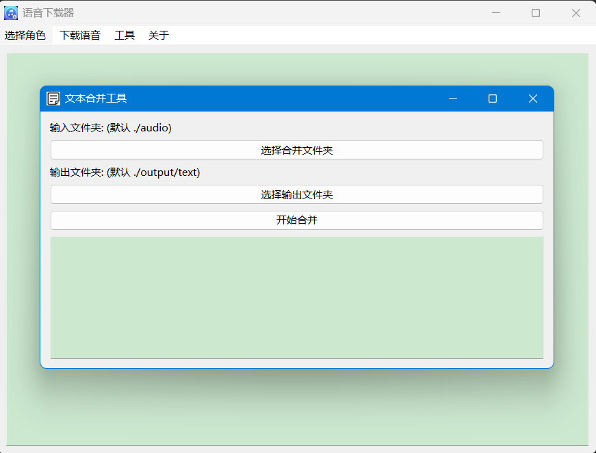
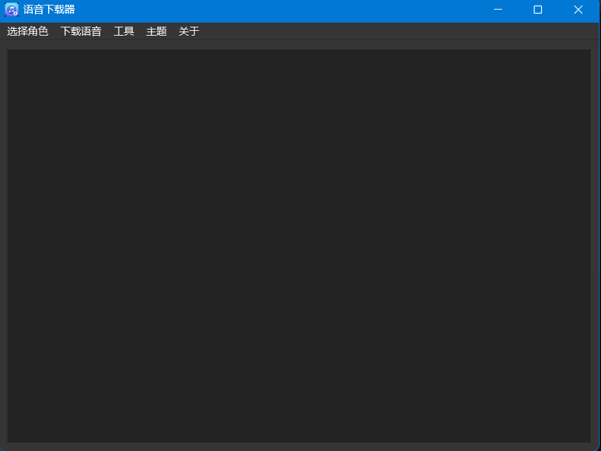

# catalogue

**[English](README_en.md) | [简体中文](README.md)**

- [catalogue](#catalogue)
  - [Download link](#download-link)
  - [Function](#function)
  - [Program Structure](#program-structure)
  - [Introduction](#introduction)
  - [Installation and operation mode](#installation-and-operation-mode)
    - [Install Python library](#install-python-library)
    - [Run the program](#run-the-program)
      - [Method 1](#method-1)
      - [Method 2](#method-2)
  - [Disclaimers 🛡️](#disclaimers-️)

## Download link

[Click here to download](https://github.com/WorldDawnAres/mhy_music/releases)
>
>.exe in releases is packaged using Python version 3.10.11, which may not be supported for systems below Windows 7
>
>Linux binary files are packaged using Python version 3.9.13.
>
>Do you like this project? Please leave me a star ⭐， Let more people see it! Thank you for your support!

## Function

- [x] Support user-defined selection of Genshin Impact role
- [x] Chinese, English, Japanese, Korean can be selected
- [x] Supports Windows and Linux
- [x] Log display function
- [x] Text file merging
- [x] Custom sampling rate conversion wav file
- [x] Support custom selection of Iron Collapse characters
- [x] Supports dark color mode

## Program Structure

```bash
mhy_music
├── /mhy_music
│   ├── /icon
│   │   ├── icon.ico
│   │   ├── icon1.ico
│   │   ├── icon2.ico
│   │   └── icon3.ico
│   ├── /txt
│   │   ├── characters_bentie.txt
│   │   └── characters_yuan.txt
│   ├── /tools
│   │   ├── character_selector.py
│   │   ├── text_merger.py
│   │   ├── audio_converter.py
│   │   ├── config.py
│   │   ├── log_stream.py
│   │   └── LogWidget.py
│   ├── /tool
│   │   ├── ffmpeg.exe
│   ├── /yuan
│   │   ├── yuan_audio_download_en.py
│   │   ├── yuan_audio_download_jp.py
│   │   ├── yuan_audio_download_zh.py
│   │   └── yuan_audio_download_ko.py
│   ├── /bentie
│   │   ├── bentie_audio_download_en.py
│   │   ├── bentie_audio_download_jp.py
│   │   ├── bentie_audio_download_zh.py
│   │   └── bentie_audio_download_ko.py
│   ├── main.py
└── /README.md
```

## Introduction

>This program is used to download and convert audio, and merge text to provide voice data of MHY game characters for AI model training.
>
>Users can choose to customize the role of Genshin Impact and the role of iron shattering, and support the selection of Chinese, English, Japanese and Korean
>
>After downloading, customize the conversion of audio files to WAV format and merge text files


>
>Users can select functions through the menu. If no character is selected in the current version, all downloads will be defaulted
>
>Select and execute the parameters required by the program in the audio download, audio conversion, and text merging functions
>
>The GUI interface of the program supports log display, making it easy for users to view operation records.




>In addition, it supports dark mode, and users can choose to use dark mode or light mode according to their preferences



## Installation and operation mode

### Install Python library

>Use the following command to install the required Python libraries:

```bash
pip install aiohttp beautifulsoup4 PySide6 qasync
pip install PyInstaller(optional)
```

### Run the program

>You can use any of the following methods to run the program:

#### Method 1

>Using PyInstaller to package programs:
>
>1.You need to download ffmpeg from the official ffmpeg website and place it in the/myy_music/tool/directory

[click here to download ffmpeg](https://www.gyan.dev/ffmpeg/builds/packages/ffmpeg-7.0.2-full_build.7z)
>2.After downloading from the link above, unzip the compressed file and find ffmpeg.exe in the bin to the/myy_music/tool/directory (if no folder is created, create it yourself)
>
>3.Then use the following command to package the program:

```bash
PyInstaller -F --add-data "./txt/*;txt" --add-data "./icon/*;icon" --add-data "./tool/*;tool" -w -i ./icon/icon.ico main.py
```

>Finally, locate the executable file in the dist directory.

#### Method 2

>Directly run Python script:
>
>You need to install the corresponding library, complete the steps to download ffmpeg, and then run main.exe directly

```bash
python main.py
```

## Disclaimers 🛡️

>This project is only for learning and personal communication purposes. The copyright of all audio and text content downloaded by the program belongs to the original copyright owner.
>
>Please do not use this program for any commercial or illegal purposes.
>
>Please use this program reasonably. The developer is not responsible for any risks or consequences caused by its use, such as IP blocking or other issues.
>
>If you are the content rights holder and believe that this project involves infringement, please contact us through issue or email, and the developer will handle it as soon as possible.
>
>Thank you for your understanding and support!
